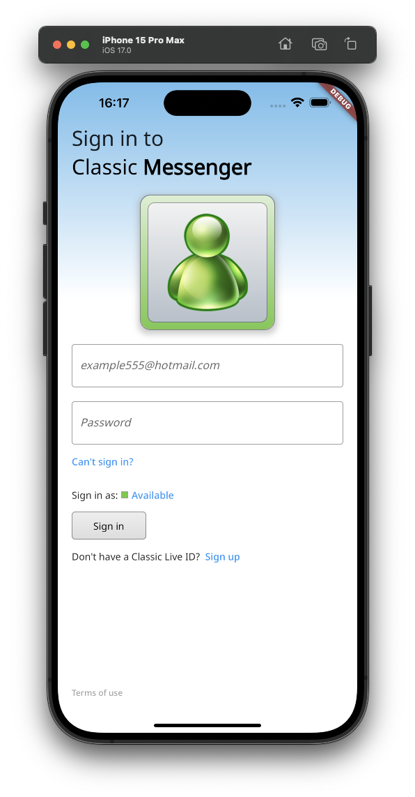

# classic_messenger

### 🚧🧱🔨 This app is a work in progress

A chat app built in Flutter meant as a throwback to older messenger apps.



## Building the app

Firebase Authentication, Firestore Database, and Firebase Storage must be configured using the flutterfire_cli to build the app.

### Building generated files

```sh
dart run build_runner build --delete-conflicting-outputs
```
